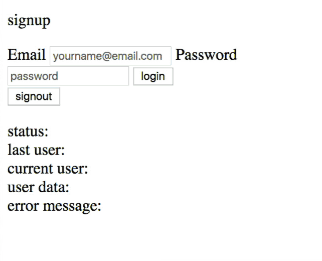

# Curriculum For Teaching How To Build A `MVC Framework`
 > `Vanilla` `Javascript` `CRUD` `SPA` `MVP` for teaching _junior devs_ on *__how__* to work with frameworks faster.

 * Dependencies:
    > all dependencies are in the `lib` folder
    - [`require.js`](https://cdnjs.com/libraries/require.js)
        > used for loading in a custom template language
    - [require-text.js](https://cdnjs.com/libraries/require-text)
        > An AMD loader plugin for loading the text templates with a `regex`.
    - [`load.js`](https://cdnjs.com/libraries/loadjs)
        > async loading with promises
    - [`firebase.js`](https://firebase.google.com/docs/reference/js)
        > used for crud features and shipping the `MVP`

## Overview:
 - _Primary Goal_: teaching MVC structure to juniors and entry-level devs
 - _Secondary_: teaching the ability to reverse engineer and working with different frameworks

This is a custom framework built to be used as curriculum for teaching, onboarding, and mentoring _junior devs_.

All code is written to be readable, using traditional `ES5` code with the goal of being able to speed up the process of learning how to reverse engineer a framework.

Sure, it may seem verbose at times - but the goal is to teach different ways of learning how to learn frameworks _quickly_.


## What does the `App` do?
 > all the basic [`CRUD`](https://developer.mozilla.org/en-US/docs/Glossary/CRUD) features needed to create an `MVP Vanilla Framework`

 


### Code Style:

When possible the [`Python` PEP 8](https://www.python.org/dev/peps/pep-0008/) style coding practices were used

 - `dot notation` with `IIFE's` over `bracket notation`
    > `app.contoller.user.singin` _versus_ `app.controller[user].signin()`
 - `single quotes` over `double quotes`.
 - `underscores` over `dashes`
    > `var name_of_property` _versus_  `var name-of-property`

## How do I get started?
 > Config: `app.config.js` file with `firebase` credentials
```javascript
var firebase_config = {
        apiKey: FIREBASE_API_KEY,
        authDomain: FIREBASE_API_AUTH_DOMAIN,
        databaseURL: FIREBASE_API_DATABASE_URL,
        storageBucket: ''
};
```

---

## A few common questions _junior devs_ typically ask:

### What is .prototype?
`.prototype` is used to target an object constructor directly, rather than individual objects.

You can find information on the usage of `.prototype` [here](https://developer.mozilla.org/en-US/docs/Learn/JavaScript/Objects/Object_prototypes)

### What is a try/catch function doing?
This is similar to if/else statement. Try/catch statements are used for testing code for errors. The try statement is filled with what is to be tested. The catch statement is filled with how you wish to handle errors that are caught.

You can read more about try/catch statements [here](https://developer.mozilla.org/en-US/docs/Web/JavaScript/Reference/Statements/try...catch)

### What's with the modules that return just an empty JSON object?
This is done to instantiate an object for further use. Once instantiated, the object can have methods and properties added to it.

### What is the *_traverse_* function used for?

```javascript
function traverse( object_to_traverse , callback_function ) {
    for (var item in object_to_traverse) {
        callback_function.apply(this,[ item , object_to_traverse [ item ]]);
        if ( object_to_traverse [ item ] !== null && typeof( object_to_traverse [ item ]) == 'object') {
            traverse( object_to_traverse [ item ],callback_function);
        }
    }
}
```
This function creates an `object tree` of `objects`. It's impossible to know exactly how many objects there may be. In addition, you may be unsure on how many properties those objects may have. The `traverse function` loops over each object and builds an `object tree`.

### What is .once?
.once is a method used to fire an event only once for a particular object.

### What is the anonymous function that is called after *_require_* is called in app.js?
```javascript
function(){

    app.config();

    require([
    'framework/app.view.signin',
    ],function(html_data){
        App.prototype.user.view = html_data;
        App.prototype.util.element.get('body').innerHTML = html_data;
        App.prototype.controller.signin();
});
```

This `callback function` runs first with the app config.
Then configures the `app` to use the `firebase` database.
Finally, it pulls in the `view`, where to place the `template` and a callback function to run when complete for the `signin` process.

### What is the util.mutation module used for?

An `observer function` for watching detects changes to the browser before they are attached to the `DOM`.


### What are all the `APP` `HTML` `ID selectors`?

This is a list of all IDs currently in use in the `Firebase` `App`.
They are targeted with `Javascript` targeting `CSS` `REGEX` syntax.

```css
[class^=' app-option-'] { background-color: #939393; }
```


#### HTML ID Tag Names
 > `HTML ID selectors` are listed in _alphabetical_ order.

  - `app-current-status`
  - `app-current-user`
  - `app-error-message`
  - `app-last-user`
  - `app-login`
  - `app-login-email`
  - `app-online-status`
  - `app-signin`
  - `app-signout`
  - `app-signup`
  - `app-user-container`
  - `app-user-data`
  - `app-user-data-dropdown`
  - `app-user-data-dropdown-container`
  - `app-user-data-form`
  - `app-user-data-input`
  - `app-user-data-input-container`
  - `app-user-data-key`
  - `app-user-data-option-status`
  - `app-user-data-option-value`
  - `app-user-data-value`
  - `app-user-logged-in`